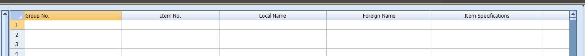

# Chapter 1: Introduction to Onxy

Welcome to the Onxy Installation and Setup documentation. This guide will walk you through the process of setting up and configuring the Onxy system.

Onxy is a comprehensive inventory management system that helps you track your products, manage stock levels, and set pricing.

## Item Grouping

One of the key features of Onxy is the ability to group items. This allows you to organize your inventory in a way that makes sense for your business.

