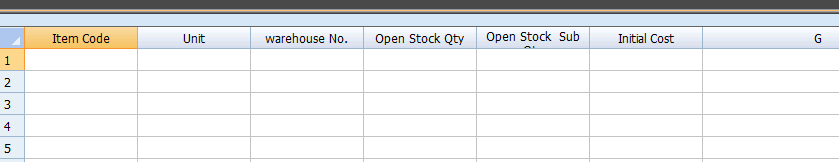
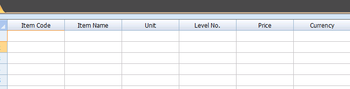

# Chapter 2: Item and Inventory Management

This chapter will delve into the details of managing items and inventory within the Onxy system.

## Item Details

Each item in Onxy has a set of attributes that you can configure, including the item code, unit, warehouse number, and initial cost.

## Item Pricing

You can also set the price and currency for each item in the system.

